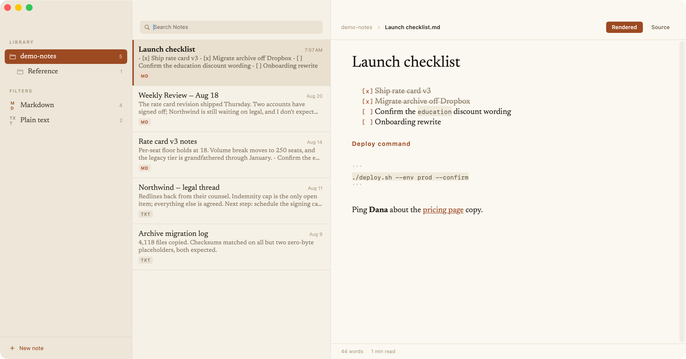
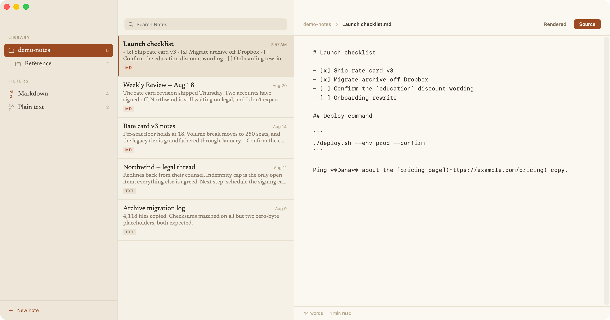

# MarkDownNotes

A native macOS notes editor for Markdown and plain-text files. Warm paper,
a serif voice (Newsreader), and your notes stored as ordinary files in a
folder you choose — no database, no lock-in.



## Features

- **Three panes** — folders, a note list with previews, and the editor
- **Multiple notes folders** — add any number of folders to the library
  (File → Add Notes Folder…); each appears in the sidebar with its
  subfolders, with Markdown/plain-text filters across all of them
- **Edit in rendered mode** — Markdown styles itself in place as you type;
  headers, bold, italics, code, quotes, lists, and links render live while
  the syntax markers stay visible, dimmed
- **Source mode** — a plain monospaced view of the same file, one click
  (or ⌘L) away; the caret keeps its place when you switch
- **Autosave** — writes shortly after you stop typing, and on note-switch,
  app-switch, and quit
- **Newest on top** — the note list always sorts by last modified
- **Plays well with other tools** — edits made outside the app appear live;
  notes are plain `.md` / `.txt` files on disk



## Install

Download `MarkDownNotes-x.y.dmg` from the
[Releases](../../releases) page, open it, and drag the app to Applications.

The app is ad-hoc signed (not notarized), so on first launch macOS will
warn you. Right-click the app → **Open** → **Open**, or clear the
quarantine flag:

```
xattr -dr com.apple.quarantine /Applications/MarkDownNotes.app
```

On first run the app creates `~/Documents/MarkDownNotes` with a welcome
note. Add more folders via **File → Add Notes Folder…** (⇧⌘O); remove
one from the sidebar via right-click.

## Build from source

Requires Xcode (or the command-line tools) on macOS 14+:

```
./App/build-app.sh
```

That compiles the Swift package, assembles `MarkDownNotes.app` in the
repository root, and ad-hoc signs it. `App/make-icon.swift` regenerates
the app icon.

## Design

The app's look was chosen from five mockup directions (see `design/`);
the shipped style combines the *Manuscript* palette and typography with
the *Ledger* three-pane layout.

## License

The code is licensed under the [MIT License](LICENSE).

The bundled [Newsreader](https://github.com/productiontype/Newsreader)
fonts are licensed separately under the SIL Open Font License 1.1
(`App/Fonts/OFL.txt`).
